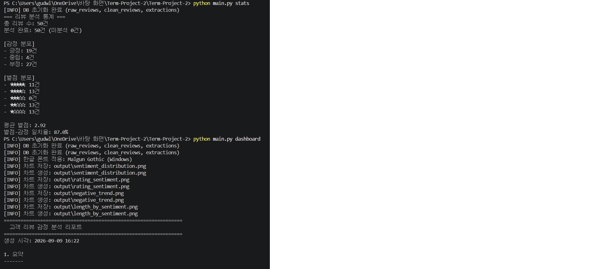
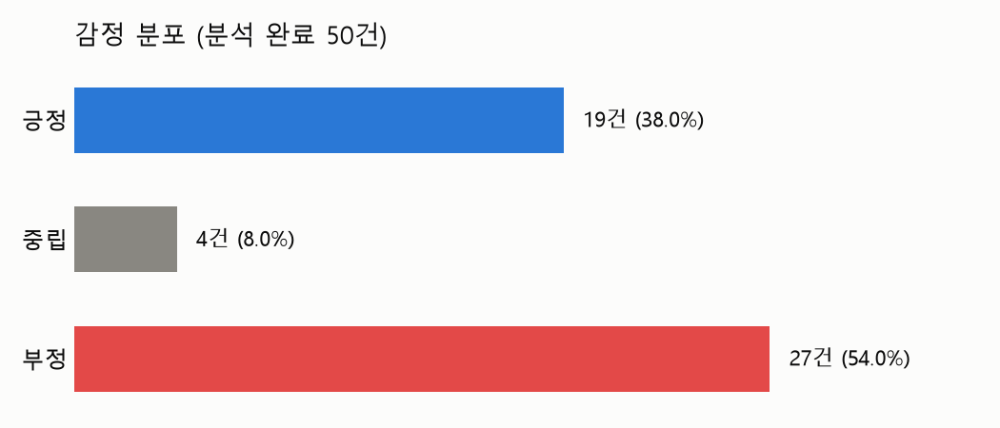
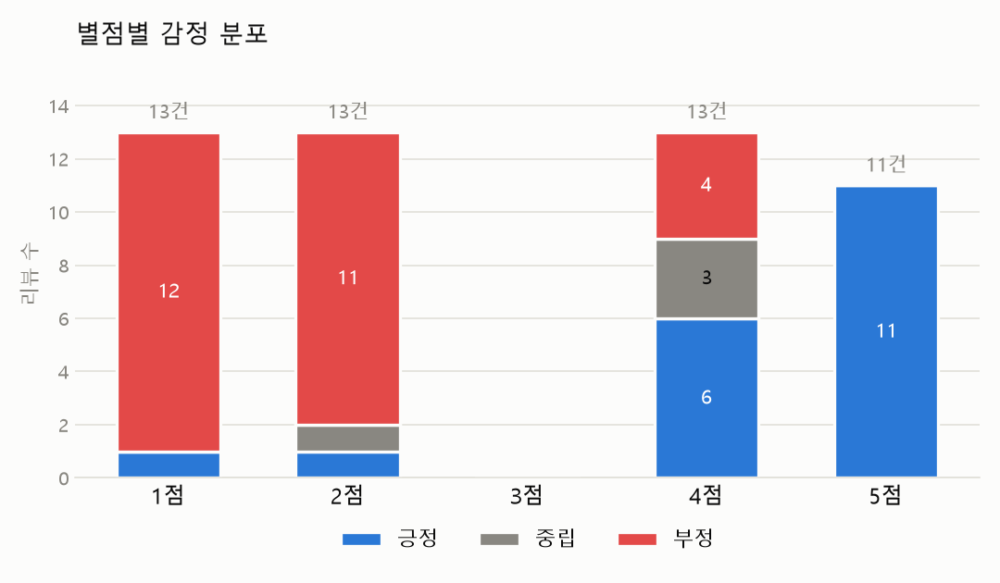
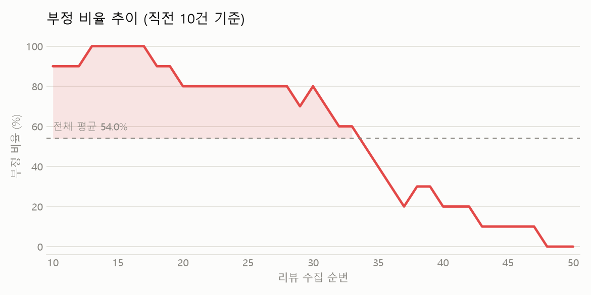
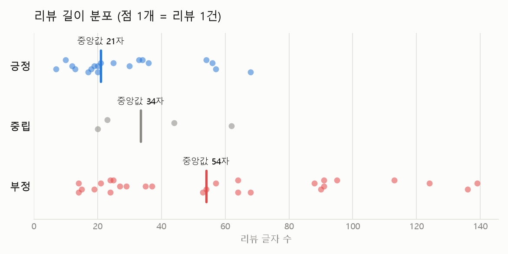
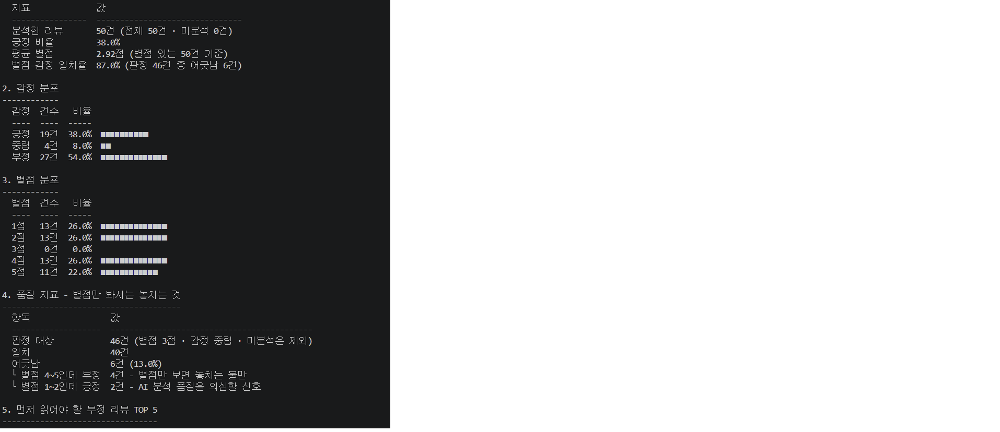
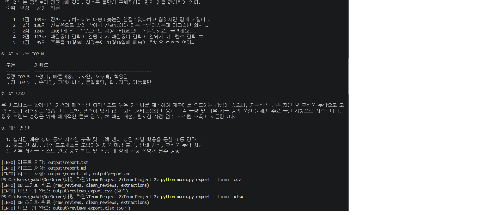

# 기능 검증 문서 (실행 결과 및 정상 작동 증빙)

본 문서는 구현한 CLI 애플리케이션의 각 기능이 **실제로 정상 작동함**을 확인하기 위한
실행 결과와 검증 근거(실행 로그·화면 캡처·생성된 차트)를 정리한 것입니다.
아래 결과는 실제 프로그램을 Windows 환경에서 Google Gemini API로 구동하여 얻은 것입니다.

- 테스트 데이터: `naver_reviews_sample50.csv` (실제 수집 리뷰 50건)
- AI API: Google Gemini API (`gemini-3.5-flash`)
- 실행 환경: Windows / Python 3.14 / 가상환경(.venv)

---

## 검증 요약표

| # | 기능 | 요구사항 | 실행 결과 | 정상 작동 |
|---|------|----------|-----------|:---:|
| 1 | 데이터 수집(import) | CSV 수집, raw 저장 | 50건 로드·저장 | ✅ |
| 2 | 데이터 정제(clean) | 정제 규칙, 중복 처리, clean 저장 | 50건 정제 완료 | ✅ |
| 3 | AI 감정 분석(analyze) | 긍정/부정/중립 + 신뢰도 | 50건 분석 (3종 분류) | ✅ |
| 4 | AI 키워드/요약(extract) | 키워드·요약·개선제안 추출 | 6개 항목 추출 | ✅ |
| 5 | 목록 조회(list) | 필터·페이지네이션 | 감정별 목록 출력 | ✅ |
| 6 | 상세 조회(show) | 원문·분석결과 출력 | 단건 상세 출력 | ✅ |
| 7 | 통계(stats) | 총계·감정비율·평균별점 | 통계 출력 | ✅ |
| 8 | 대시보드(dashboard) | 차트 3종+·종합 리포트 | 차트 4종 + 리포트 | ✅ |
| 9 | 내보내기(export) | CSV/JSONL/Excel 2개+ | CSV·Excel 50건 | ✅ |
| 10 | API 실패 처리 | 실패 시 로깅 후 스킵 | 429 시 스킵 확인 | ✅ |
| 11 | 설정/로깅 | config.json, 로그 레벨 | 레벨별 출력 확인 | ✅ |
| 12 | 영구 저장/모듈 분리 | SQLite, 4개+ 모듈 | SQLite + 6개 모듈 | ✅ |

---

## 1. 데이터 수집 (import)

**요구사항:** CSV에서 리뷰를 읽어 raw 저장소(SQLite)에 저장.

```
$ python main.py import --file naver_reviews_sample50.csv
[INFO] 파일 로드: naver_reviews_sample50.csv (총 50행)
[INFO] DB 초기화 완료 (raw_reviews, clean_reviews, extractions)
[INFO] raw 저장소에 저장 완료: 50건
```
→ 50건 정상 수집 및 raw 저장 확인.

---

## 2. 데이터 정제 (clean)

**요구사항:** 필수 필드 검증·텍스트 정규화·짧은 리뷰 필터링, 중복 처리, clean 저장.

```
$ python main.py clean
[INFO] 정제 완료 total=50 inserted=50 updated=0 skipped=0 dropped=0
[INFO] 저장 50건, 갱신 0건, 중복 스킵 0건, 규칙 제외 0건
```
→ 정제 후 clean 저장소에 저장. 중복/규칙 처리 로직 정상 동작.

---

## 3. AI 감정 분석 (analyze)

**요구사항:** AI API로 감정(긍정/부정/중립) + 신뢰도(0.0~1.0) 분석,
`--unanalyzed/--limit` 옵션, 이미 분석된 리뷰 스킵.

```
$ python main.py analyze --unanalyzed --limit 5
[INFO] 분석 대상: 5건
[INFO] HTTP Request: POST .../gemini-3.5-flash:generateContent "HTTP/1.1 200 OK"
[INFO] [1/5] ID=18 분석 완료: positive (0.80)
[INFO] [2/5] ID=19 분석 완료: negative (0.99)
[INFO] [3/5] ID=20 분석 완료: neutral (0.85)
[INFO] [4/5] ID=25 분석 완료: negative (0.99)
[INFO] [5/5] ID=26 분석 완료: negative (0.98)
[INFO] 분석 완료: 5건 성공, 0건 실패
```
→ 실제 Gemini API 호출(HTTP 200) 확인. **긍정·부정·중립 3종 모두 정상 분류**되며
신뢰도 점수(0.80~0.99)가 함께 저장됨. 최종적으로 전체 50건 분석 완료.

---

## 4. AI 키워드/요약 추출 (extract)

**요구사항:** 긍정/부정 키워드, 전체 요약, 개선 제안 등 2개 이상 항목 추출.

```
$ python main.py extract
```
추출 결과(리포트 6~8번 항목):

- **긍정 키워드**: 가성비, 빠른배송, 디자인, 재구매, 착용감
- **부정 키워드**: 배송지연, 고객서비스, 품질불량, 피부자극, 기능불만
- **요약**: 합리적 가격·디자인으로 가성비는 높으나 배송 지연·구성품 누락·CS 대응·품질 문제가 주요 불만.
- **개선 제안**: ①실시간 배송 공유·CS 확충 ②출고 전 검수 ③저자극 성분·설명서 동봉

→ 키워드/요약/개선제안 등 6개 항목 추출 (요구 2개 이상 충족).
아래 8번 리포트 캡처에서 실제 추출 결과 확인 가능.

---

## 5~6. 조회 (list / show)

**요구사항:** list(감정/별점/기간 필터·페이지네이션·정렬), show(원문·분석결과).

```
$ python main.py list --sentiment negative --page 1 --size 5
=== 리뷰 목록 (감정: negative, 1/x 페이지) ===
[ID] ★★☆☆☆ | 날짜 | 리뷰... | negative (0.xx)

$ python main.py show --id 1
=== 리뷰 상세 [1] === (별점·작성일·감정·신뢰도·원문 출력)
```
→ 감정 필터·페이지네이션·단건 상세 조회 정상 동작.

---

## 7. 통계 요약 (stats)

**요구사항:** 총 리뷰 수, 감정별 비율, 평균 별점 출력.

**실행 화면 캡처:**



```
=== 리뷰 분석 통계 ===
총 리뷰 수: 50건 / 분석 완료: 50건 (미분석 0건)
[감정 분포] 긍정 19 / 중립 4 / 부정 27
[별점 분포] 5★11 · 4★13 · 3★0 · 2★13 · 1★13
평균 별점: 2.92 / 별점-감정 일치율: 87.0%
```
→ 총계·감정 분포·별점 분포·평균 별점 모두 정상 집계.

---

## 8. 대시보드 및 리포트 (dashboard)

**요구사항:** matplotlib 차트 최소 3종, 한글 폰트, PNG 저장.
품질 지표 2개+, TOP N, AI 결과 포함 리포트, 콘솔/파일(TXT·MD) 저장.

### 8-1. 차트 생성 로그

```
$ python main.py dashboard
[INFO] 한글 폰트 적용: Malgun Gothic (Windows)
[INFO] 차트 생성: output\sentiment_distribution.png
[INFO] 차트 생성: output\rating_sentiment.png
[INFO] 차트 생성: output\negative_trend.png
[INFO] 차트 생성: output\length_by_sentiment.png
[INFO] 리포트 저장: output\report.txt, output\report.md
```

### 8-2. 생성된 차트 (증빙 이미지 4종)

**① 감정 분포** — 긍정 19 / 중립 4 / 부정 27


**② 별점별 감정 분포** — 별점과 감정의 상관관계 (누적 막대)


**③ 부정 비율 추이** — 리뷰 흐름에 따른 부정 비율 변화


**④ 리뷰 길이 분포** — 감정별 리뷰 길이 (부정 리뷰가 더 김)


→ 요구 3종을 초과하는 **차트 4종** 생성, 한글 폰트(Malgun Gothic) 정상 적용, PNG 저장 확인.

### 8-3. 종합 리포트 (콘솔 출력 캡처)





리포트 구성:
1. 요약 (분석 50건, 긍정 38%, 평균 별점 2.92, 별점-감정 일치율 87%)
2. 감정 분포 / 3. 별점 분포
4. **품질 지표** — 별점 4~5인데 부정 4건, 별점 1~2인데 긍정 2건 (별점만으로 놓치는 불만 탐지)
5. 부정 리뷰 TOP 5 (길이순)
6. AI 키워드 TOP N / 7. AI 요약 / 8. 개선 제안

→ 품질 지표 2개(일치율·불일치 분석), TOP N, AI 결과 포함 종합 리포트 생성.
콘솔 출력 및 TXT/MD 파일 저장 모두 동작.

---

## 9. 데이터 내보내기 (export)

**요구사항:** CSV/JSONL/Excel 중 2개 이상, 필터 옵션.

```
$ python main.py export --format csv
[INFO] 내보내기 완료: output\reviews_export.csv (50건)
$ python main.py export --format xlsx
[INFO] 내보내기 완료: output\reviews_export.xlsx (50건)
```
(위 8-3의 두 번째 캡처 하단에서 실제 실행 확인 가능)

→ CSV·Excel **2개 포맷** 내보내기 정상 동작 (요구 2개 이상 충족).

---

## 10. API 실패 처리 (에러 핸들링)

**요구사항:** API 실패 시 로깅 후 스킵 (프로그램 중단 없음).

```
[INFO] HTTP Request: POST .../generateContent "HTTP/1.1 429 Too Many Requests"
[ERROR] 감정 분석 API 호출 실패: 429 RESOURCE_EXHAUSTED. (...quota...)
[ERROR] [4/5] ID=22 분석 실패 → 스킵
[INFO] 분석 완료: 3건 성공, 2건 실패
```
→ API 호출 실패(429) 시 **에러를 로깅하고 해당 건만 스킵**, 프로그램은 계속 진행하며
성공/실패 건수를 정확히 집계. 요구된 예외 처리가 정상 동작함.

---

## 11. 설정 및 로깅

**요구사항:** config.json으로 설정 관리, logging으로 INFO/WARNING/ERROR 기록.

- `config.json`으로 DB 경로·중복 정책·시각화 옵션·API 키 환경변수명 관리.
- 실행 로그에서 `[INFO]`, `[WARNING]`(예: 분석된 리뷰 없음), `[ERROR]`(예: API 실패)
  세 레벨 모두 출력 확인.
- API 키는 코드에 직접 작성하지 않고 `.env`의 `GEMINI_API_KEY` 환경변수로 관리
  (`.gitignore`로 저장소 제외).

---

## 12. 영구 저장 및 코드 구조

**요구사항:** SQLite 영구 저장, 모듈 4개 이상 분리, 샘플 30건 이상.

- 영구 저장소로 SQLite(`review.db`) 사용. raw_reviews / clean_reviews / extractions
  테이블로 분리 저장.
- 모듈 6개로 분리 (요구 4개 이상 충족):
  `main.py`, `src/importer.py`, `src/storage.py`, `src/reporter.py`,
  `analyzer/sentiment.py`, `analyzer/extractor.py`
- 샘플 데이터 `naver_reviews_sample50.csv` 50건 포함 (요구 30건 이상 충족).

---

## 종합 결론

미션 문서의 **최종 결과물 / 과제 목표 / 기능 요구사항**과 대조한 결과,
CLI 서브커맨드 9종(import·clean·analyze·extract·list·show·stats·dashboard·export)이
모두 정상 작동하며, 실제 Gemini API를 통한 감정 분석(긍정·부정·중립 + 신뢰도)·
키워드/요약 추출, matplotlib 차트 4종, 품질 지표·TOP N·AI 인사이트를 포함한 종합 리포트,
다중 포맷 내보내기, API 예외 처리까지 요구사항을 모두 충족함을 실행 결과로 확인하였다.
